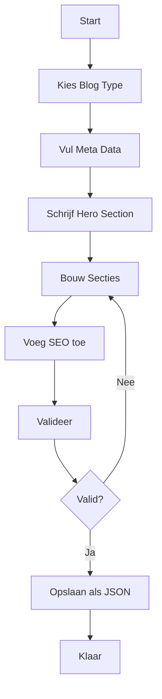

# Tesoro CRM Blog System - Complete Documentatie

Dit document beschrijft het complete blog systeem voor Tesoro CRM, speciaal ontworpen voor AI agents om consistente, meertalige blog posts te genereren.

## 📚 Inhoudsopgave

1. [Overzicht](#overzicht)
2. [Architectuur](#architectuur)
3. [Voor AI Agents](#voor-ai-agents)
4. [Voor Developers](#voor-developers)
5. [Content Structuur](#content-structuur)
6. [Deployment](#deployment)

---

## 🎯 Overzicht

### Wat is dit systeem?

Een complete blog infrastructuur die:
- ✅ **JSON-based content** gebruikt voor maximale flexibiliteit
- ✅ **Meertalig** is (Nederlands, Engels, Spaans)
- ✅ **AI-agent ready** met duidelijke richtlijnen en validatie
- ✅ **Component-based rendering** voor consistente styling
- ✅ **SEO-geoptimaliseerd** met structured data
- ✅ **Type-safe** met TypeScript definities

### Waarom JSON in plaats van MDX?

| Aspect | JSON | MDX |
|--------|------|-----|
| **Meertaligheid** | ✅ Ingebouwd | ❌ Moeilijk |
| **Validatie** | ✅ Type-safe | ⚠️ Beperkt |
| **AI Generation** | ✅ Makkelijk | ⚠️ Complex |
| **Consistentie** | ✅ Gegarandeerd | ⚠️ Variabel |
| **Flexibiliteit** | ✅ Hoog | ✅ Hoog |

---

## 🏗️ Architectuur

### Directory Structuur

```
tesoro-crm-website/
├── src/
│   ├── types/
│   │   └── blog.ts                    # TypeScript type definitions
│   ├── components/
│   │   └── blog/
│   │       ├── sections/              # Section components
│   │       │   ├── IntroductionSection.astro
│   │       │   ├── ProblemSection.astro
│   │       │   ├── SolutionSection.astro
│   │       │   ├── ResultsSection.astro
│   │       │   ├── QuoteSection.astro
│   │       │   ├── TakeawaysSection.astro
│   │       │   └── CTASection.astro
│   │       ├── SectionRenderer.astro  # Auto-routing component
│   │       └── RelatedPosts.astro
│   ├── content/
│   │   └── blog/
│   │       └── *.json                 # Blog posts in JSON
│   ├── pages/
│   │   └── blog/
│   │       ├── index.astro            # Blog listing
│   │       └── [...slug].astro        # Blog post renderer
│   └── utils/
│       └── blogHelpers.ts             # Helper functions
├── docs/
│   ├── AI_BLOG_GUIDELINES.md          # Complete guidelines (50+ pages)
│   └── AI_BLOG_QUICK_START.md         # Quick reference
└── public/
    └── images/
        └── blog/
            └── [post-slug]/           # Images per post
```

### Data Flow

```
JSON Blog Post
    ↓
Type Validation (TypeScript)
    ↓
Content Collection (Astro)
    ↓
Section Renderer
    ↓
Section Components
    ↓
Rendered HTML
```

---

## 🤖 Voor AI Agents

### Quick Start

1. **Lees de guidelines**:
   - `docs/AI_BLOG_GUIDELINES.md` - Complete richtlijnen
   - `docs/AI_BLOG_QUICK_START.md` - Snelle referentie

2. **Bekijk het voorbeeld**:
   - `src/content/blog/makelaar-website-transformatie.json`

3. **Gebruik de types**:
   - `src/types/blog.ts` - TypeScript definities

4. **Valideer je output**:
   - `src/utils/blogHelpers.ts` - Validatie functies

### Blog Post Generatie Flow



### Beschikbare Sectie Types

| Type | Gebruik | Verplicht |
|------|---------|-----------|
| `introduction` | Opening van artikel | ✅ Ja (eerste) |
| `problem` | Probleem beschrijving | ⚠️ Aanbevolen |
| `solution` | Oplossing met subsecties | ✅ Ja |
| `results` | Resultaten met metrics | ⚠️ Voor case studies |
| `quote` | Testimonial/citaat | ❌ Optioneel |
| `takeaways` | Belangrijkste punten | ⚠️ Aanbevolen |
| `technical` | Technische details | ❌ Optioneel |
| `faq-section` | Veelgestelde vragen | ❌ Optioneel |
| `cta` | Call-to-action | ✅ Ja (laatste) |

### Validatie Regels

**Verplicht**:
- ✅ Alle 3 talen compleet (nl, en, es)
- ✅ Eerste sectie = `introduction`
- ✅ Laatste sectie = `cta`
- ✅ Unieke sectie IDs
- ✅ Hero image met alt texts
- ✅ Minimaal 3 secties

**Aanbevolen**:
- ⚠️ 3-8 tags
- ⚠️ 3-5 SEO keywords
- ⚠️ 2-3 related posts
- ⚠️ Reading time accuraat
- ⚠️ Problem voor Solution
- ⚠️ Solution voor Results

---

## 👨‍💻 Voor Developers

### Setup

```bash
# Install dependencies
npm install

# Run dev server
npm run dev

# Build for production
npm run build
```

### Content Collection Schema

Het blog systeem gebruikt Astro Content Collections. Update `src/content/config.ts` om JSON posts te ondersteunen:

```typescript
import { defineCollection, z } from 'astro:content';

const blog = defineCollection({
  type: 'data', // Voor JSON files
  schema: z.object({
    meta: z.object({
      id: z.string(),
      version: z.string(),
      // ... meer velden
    }),
    hero: z.object({
      title: z.object({
        nl: z.string(),
        en: z.string(),
        es: z.string(),
      }),
      // ... meer velden
    }),
    sections: z.array(z.any()), // Dynamische section types
  }),
});

export const collections = { blog };
```

### Rendering een Blog Post

In `src/pages/blog/[...slug].astro`:

```astro
---
import { getCollection } from 'astro:content';
import SectionRenderer from '../../components/blog/SectionRenderer.astro';
import type { Language } from '../../types/blog';

// Get blog post
const { slug } = Astro.params;
const posts = await getCollection('blog');
const post = posts.find(p => p.id === slug);

// Get current language
const lang: Language = 'nl'; // Of uit Astro.currentLocale
---

<article>
  <!-- Hero -->
  <h1>{post.data.hero.title[lang]}</h1>
  <p>{post.data.hero.description[lang]}</p>
  
  <!-- Sections -->
  {post.data.sections.map(section => (
    <SectionRenderer section={section} lang={lang} />
  ))}
</article>
```

### Nieuwe Sectie Type Toevoegen

1. **Definieer type** in `src/types/blog.ts`:
```typescript
export interface CustomSection extends BaseSection {
  type: 'custom';
  customField: LocalizedText;
}

export type Section = 
  | IntroductionSection
  | CustomSection  // Voeg toe
  | ...
```

2. **Maak component** in `src/components/blog/sections/CustomSection.astro`:
```astro
---
import type { CustomSection, Language } from '../../../types/blog';

interface Props {
  section: CustomSection;
  lang: Language;
}

const { section, lang } = Astro.props;
---

<section class="blog-section blog-section--custom">
  <!-- Custom rendering -->
</section>
```

3. **Update renderer** in `src/components/blog/SectionRenderer.astro`:
```astro
---
import CustomSection from './sections/CustomSection.astro';

const componentMap = {
  // ...
  custom: CustomSection,
};
---
```

### Helper Functions

```typescript
import {
  validateBlogPost,
  calculateReadingTime,
  generateStructuredData,
  formatDate
} from '../utils/blogHelpers';

// Valideer post
const validation = validateBlogPost(post);
if (!validation.valid) {
  console.error(validation.errors);
}

// Bereken leestijd
const readingTime = calculateReadingTime(content);

// Genereer structured data
const structuredData = generateStructuredData(post, 'nl', url);
```

---

## 📝 Content Structuur

### Minimale Blog Post

```json
{
  "meta": {
    "id": "mijn-blog-post",
    "version": "1.0.0",
    "createdAt": "2024-01-15T10:00:00Z",
    "updatedAt": "2024-01-15T10:00:00Z",
    "author": {
      "name": "Auteur Naam",
      "image": "/images/authors/auteur.jpg",
      "bio": {
        "nl": "Bio in Nederlands",
        "en": "Bio in English",
        "es": "Bio en Español"
      }
    },
    "category": "case-study",
    "tags": ["tag1", "tag2", "tag3"],
    "featured": false,
    "draft": false,
    "readingTime": 5,
    "aiGenerated": true
  },
  "seo": {
    "canonicalURL": "https://tesorohq.io/blog/mijn-blog-post",
    "socialImage": "/images/blog/mijn-blog-post/social.jpg",
    "keywords": ["keyword1", "keyword2"]
  },
  "hero": {
    "title": {
      "nl": "Nederlandse Titel",
      "en": "English Title",
      "es": "Título en Español"
    },
    "description": {
      "nl": "Nederlandse beschrijving",
      "en": "English description",
      "es": "Descripción en español"
    },
    "image": {
      "src": "/images/blog/mijn-blog-post/hero.jpg",
      "alt": {
        "nl": "Alt text NL",
        "en": "Alt text EN",
        "es": "Alt text ES"
      },
      "width": 1200,
      "height": 600
    },
    "publishDate": "2024-01-15"
  },
  "sections": [
    {
      "type": "introduction",
      "id": "intro",
      "content": {
        "nl": { "text": "<p>Nederlandse intro</p>" },
        "en": { "text": "<p>English intro</p>" },
        "es": { "text": "<p>Intro en español</p>" }
      }
    },
    {
      "type": "cta",
      "id": "cta",
      "title": {
        "nl": "Aan de slag",
        "en": "Get Started",
        "es": "Comenzar"
      },
      "content": {
        "nl": { "text": "<p>CTA tekst</p>" },
        "en": { "text": "<p>CTA text</p>" },
        "es": { "text": "<p>Texto CTA</p>" }
      },
      "buttons": [
        {
          "text": {
            "nl": "Button NL",
            "en": "Button EN",
            "es": "Button ES"
          },
          "url": "/contact",
          "style": "primary"
        }
      ]
    }
  ],
  "relatedPosts": [],
  "faq": []
}
```

### Complete Voorbeelden

Zie `src/content/blog/makelaar-website-transformatie.json` voor een volledig voorbeeld met:
- Alle sectie types
- Multiple subsections
- Images en captions
- Metrics en results
- Quotes en testimonials
- FAQ items

---

## 🚀 Deployment

### Pre-deployment Checklist

- [ ] Alle blog posts gevalideerd
- [ ] Images geoptimaliseerd en geplaatst
- [ ] Alt texts compleet in alle talen
- [ ] Related posts links werken
- [ ] SEO data compleet
- [ ] Reading times accuraat
- [ ] No TypeScript errors
- [ ] Build succesvol

### Build Process

```bash
# Validate all posts
npm run validate:blog

# Build site
npm run build

# Preview build
npm run preview
```

### Image Optimization

Plaats images in `/public/images/blog/[slug]/`:

```bash
public/
└── images/
    └── blog/
        └── mijn-post/
            ├── hero.jpg          # 1200x600px, <200KB
            ├── section-1.jpg     # 800x400px, <150KB
            ├── section-2.jpg     # 800x400px, <150KB
            └── social.jpg        # 1200x630px, <200KB
```

**Optimalisatie tools**:
- [TinyPNG](https://tinypng.com/) - Compressie
- [Squoosh](https://squoosh.app/) - Conversie & compressie
- [ImageOptim](https://imageoptim.com/) - Batch optimalisatie

---

## 📊 Metrics & Analytics

### Tracking

Elke blog post tracked automatisch:
- Page views
- Reading time (actual vs estimated)
- Scroll depth
- CTA clicks
- Share button clicks

### SEO Monitoring

- Google Search Console integratie
- Structured data validatie
- Core Web Vitals tracking
- Keyword rankings

---

## 🔧 Troubleshooting

### Blog Post Wordt Niet Getoond

1. **Check bestandsnaam**: Moet `.json` extensie hebben
2. **Valideer JSON**: Gebruik JSON validator
3. **Check draft status**: `draft: false` voor publicatie
4. **Rebuild**: `npm run build` opnieuw uitvoeren

### TypeScript Errors

1. **Check types**: Alle velden moeten matchen met `blog.ts`
2. **Missing languages**: Alle LocalizedText moeten nl, en, es hebben
3. **Section types**: Moet een van de gedefinieerde types zijn

### Images Laden Niet

1. **Check path**: Moet beginnen met `/images/blog/`
2. **File exists**: Controleer in `/public/images/blog/`
3. **Case sensitive**: Bestandsnamen zijn case-sensitive
4. **Format**: Gebruik JPG, PNG, of WebP

---

## 📚 Resources

### Documentatie

- **Complete Guidelines**: `docs/AI_BLOG_GUIDELINES.md` (50+ pagina's)
- **Quick Start**: `docs/AI_BLOG_QUICK_START.md` (snelle referentie)
- **Type Definitions**: `src/types/blog.ts` (TypeScript types)
- **Helper Functions**: `src/utils/blogHelpers.ts` (utilities)

### Voorbeelden

- **Complete Case Study**: `src/content/blog/makelaar-website-transformatie.json`
- **Section Components**: `src/components/blog/sections/`

### Tools

- **JSON Validator**: [jsonlint.com](https://jsonlint.com/)
- **TypeScript Playground**: [typescriptlang.org/play](https://www.typescriptlang.org/play)
- **Image Optimizer**: [tinypng.com](https://tinypng.com/)
- **SEO Checker**: [seobility.net](https://www.seobility.net/)

---

## 🤝 Contributing

### Voor AI Agents

1. Volg de guidelines in `AI_BLOG_GUIDELINES.md`
2. Valideer je output met `validateBlogPost()`
3. Test in alle 3 talen
4. Zorg voor unieke, beschrijvende content

### Voor Developers

1. Voeg nieuwe section types toe via types → component → renderer
2. Update guidelines bij wijzigingen
3. Test met voorbeeld content
4. Documenteer nieuwe features

---

## 📞 Support

**Vragen over**:
- **Content**: Zie `AI_BLOG_GUIDELINES.md`
- **Development**: Zie deze README
- **Bugs**: Maak een issue in de repository
- **Features**: Bespreek met het team

**Contact**: team@tesorohq.io

---

## 🎉 Conclusie

Dit blog systeem biedt:

✅ **Consistentie** - Gegarandeerde styling en structuur  
✅ **Meertaligheid** - Ingebouwde ondersteuning voor 3 talen  
✅ **AI-Ready** - Duidelijke richtlijnen en validatie  
✅ **Type-Safe** - TypeScript voor betrouwbaarheid  
✅ **SEO-Optimized** - Structured data en best practices  
✅ **Maintainable** - Component-based architectuur  

**Succes met het creëren van geweldige content! 🚀**
