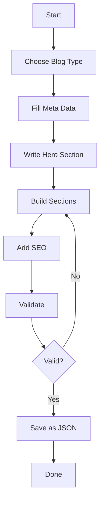

# Tesoro CRM Blog System - Complete Documentation

This document describes the complete blog system for Tesoro CRM, specially designed for AI agents to generate consistent, multilingual blog posts.

## 📚 Table of Contents

1. [Overview](#overview)
2. [Architecture](#architecture)
3. [For AI Agents](#for-ai-agents)
4. [For Developers](#for-developers)
5. [Content Structure](#content-structure)
6. [Deployment](#deployment)

---

## 🎯 Overview

### What is this system?

A complete blog infrastructure that:
- ✅ **JSON-based content** uses for maximum flexibility
- ✅ **Multilingual** is (Dutch, English, Spanish)
- ✅ **AI-agent ready** with clear guidelines and validation
- ✅ **Component-based rendering** for consistent styling
- ✅ **SEO-optimized** with structured data
- ✅ **Type-safe** with TypeScript definitions

### Why JSON instead of MDX?

| Aspect | JSON | MDX |
|--------|------|-----|
| **Multilingual** | ✅ Built-in | ❌ Difficult |
| **Validation** | ✅ Type-safe | ⚠️ Limited |
| **AI Generation** | ✅ Easy | ⚠️ Complex |
| **Consistency** | ✅ Guaranteed | ⚠️ Variable |
| **Flexibility** | ✅ High | ✅ High |

---

## 🏗️ Architecture

### Directory Structure

```
tesoro-crm-website/
├── src/
│   ├── types/
│   │   └── blog.ts                    # TypeScript type definitions
│   ├── components/
│   │   └── blog/
│   │       ├── sections/              # Section components
│   │       │   ├── IntroductionSection.astro
│   │       │   ├── ProblemSection.astro
│   │       │   ├── SolutionSection.astro
│   │       │   ├── ResultsSection.astro
│   │       │   ├── QuoteSection.astro
│   │       │   ├── TakeawaysSection.astro
│   │       │   └── CTASection.astro
│   │       ├── SectionRenderer.astro  # Auto-routing component
│   │       └── RelatedPosts.astro
│   ├── content/
│   │   └── blog/
│   │       └── *.json                 # Blog posts in JSON
│   ├── pages/
│   │   └── blog/
│   │       ├── index.astro            # Blog listing
│   │       └── [...slug].astro        # Blog post renderer
│   └── utils/
│       └── blogHelpers.ts             # Helper functions
├── docs/
│   ├── AI_BLOG_GUIDELINES.md          # Complete guidelines (50+ pages)
│   └── AI_BLOG_QUICK_START.md         # Quick reference
└── public/
    └── images/
        └── blog/
            └── [post-slug]/           # Images per post
```

### Data Flow

```
JSON Blog Post
    ↓
Type Validation (TypeScript)
    ↓
Content Collection (Astro)
    ↓
Section Renderer
    ↓
Section Components
    ↓
Rendered HTML
```

---

## 🤖 For AI Agents

### Quick Start

1. **Read the guidelines**:
   - `docs/AI_BLOG_GUIDELINES.md` - Complete guidelines
   - `docs/AI_BLOG_QUICK_START.md` - Quick reference

2. **Check the example**:
   - `src/content/blog/makelaar-website-transformatie.json`

3. **Use the types**:
   - `src/types/blog.ts` - TypeScript definitions

4. **Validate your output**:
   - `src/utils/blogHelpers.ts` - Validation functions

### Blog Post Generation Flow



### Available Section Types

| Type | Usage | Required |
|------|--------|----------|
| `introduction` | Article opening | ✅ Yes (first) |
| `problem` | Problem description | ⚠️ Recommended |
| `solution` | Solution with subsections | ✅ Yes |
| `results` | Results with metrics | ⚠️ For case studies |
| `quote` | Testimonial/quote | ❌ Optional |
| `takeaways` | Key points | ⚠️ Recommended |
| `technical` | Technical details | ❌ Optional |
| `faq-section` | Frequently asked questions | ❌ Optional |
| `cta` | Call-to-action | ✅ Yes (last) |

### Validation Rules

**Required**:
- ✅ All 3 languages complete (nl, en, es)
- ✅ First section = `introduction`
- ✅ Last section = `cta`
- ✅ Unique section IDs
- ✅ Hero image with alt texts
- ✅ Minimum 3 sections

**Recommended**:
- ⚠️ 3-8 tags
- ⚠️ 3-5 SEO keywords
- ⚠️ 2-3 related posts
- ⚠️ Accurate reading time
- ⚠️ Problem before Solution
- ⚠️ Solution before Results

---

## 👨‍💻 For Developers

### Setup

```bash
# Install dependencies
npm install

# Run dev server
npm run dev

# Build for production
npm run build
```

### Content Collection Schema

The blog system uses Astro Content Collections. Update `src/content/config.ts` to support JSON posts:

```typescript
import { defineCollection, z } from 'astro:content';

const blog = defineCollection({
  type: 'data', // For JSON files
  schema: z.object({
    meta: z.object({
      id: z.string(),
      version: z.string(),
      // ... more fields
    }),
    hero: z.object({
      title: z.object({
        nl: z.string(),
        en: z.string(),
        es: z.string(),
      }),
      // ... more fields
    }),
    sections: z.array(z.any()), // Dynamic section types
  }),
});

export const collections = { blog };
```

### Rendering a Blog Post

In `src/pages/blog/[...slug].astro`:

```astro
---
import { getCollection } from 'astro:content';
import SectionRenderer from '../../components/blog/SectionRenderer.astro';
import type { Language } from '../../types/blog';

// Get blog post
const { slug } = Astro.params;
const posts = await getCollection('blog');
const post = posts.find(p => p.id === slug);

// Get current language
const lang: Language = 'nl'; // Or from Astro.currentLocale
---

<article>
  <!-- Hero -->
  <h1>{post.data.hero.title[lang]}</h1>
  <p>{post.data.hero.description[lang]}</p>

  <!-- Sections -->
  {post.data.sections.map(section => (
    <SectionRenderer section={section} lang={lang} />
  ))}
</article>
```

### Adding a New Section Type

1. **Define type** in `src/types/blog.ts`:
```typescript
export interface CustomSection extends BaseSection {
  type: 'custom';
  customField: LocalizedText;
}

export type Section =
  | IntroductionSection
  | CustomSection  // Add here
  | ...
```

2. **Create component** in `src/components/blog/sections/CustomSection.astro`:
```astro
---
import type { CustomSection, Language } from '../../../types/blog';

interface Props {
  section: CustomSection;
  lang: Language;
}

const { section, lang } = Astro.props;
---

<section class="blog-section blog-section--custom">
  <!-- Custom rendering -->
</section>
```

3. **Update renderer** in `src/components/blog/SectionRenderer.astro`:
```astro
---
import CustomSection from './sections/CustomSection.astro';

const componentMap = {
  // ...
  custom: CustomSection,
};
---
```

### Helper Functions

```typescript
import {
  validateBlogPost,
  calculateReadingTime,
  generateStructuredData,
  formatDate
} from '../utils/blogHelpers';

// Validate post
const validation = validateBlogPost(post);
if (!validation.valid) {
  console.error(validation.errors);
}

// Calculate reading time
const readingTime = calculateReadingTime(content);

// Generate structured data
const structuredData = generateStructuredData(post, 'nl', url);
```

---

## 📝 Content Structure

### Minimal Blog Post

```json
{
  "meta": {
    "id": "my-blog-post",
    "version": "1.0.0",
    "createdAt": "2024-01-15T10:00:00Z",
    "updatedAt": "2024-01-15T10:00:00Z",
    "author": {
      "name": "Author Name",
      "image": "/images/authors/author.jpg",
      "bio": {
        "nl": "Bio in Dutch",
        "en": "Bio in English",
        "es": "Bio in Spanish"
      }
    },
    "category": "case-study",
    "tags": ["tag1", "tag2", "tag3"],
    "featured": false,
    "draft": false,
    "readingTime": 5,
    "aiGenerated": true
  },
  "seo": {
    "canonicalURL": "https://tesorohq.io/blog/my-blog-post",
    "socialImage": "/images/blog/my-blog-post/social.jpg",
    "keywords": ["keyword1", "keyword2"]
  },
  "hero": {
    "title": {
      "nl": "Dutch Title",
      "en": "English Title",
      "es": "Spanish Title"
    },
    "description": {
      "nl": "Dutch description",
      "en": "English description",
      "es": "Spanish description"
    },
    "image": {
      "src": "/images/blog/my-blog-post/hero.jpg",
      "alt": {
        "nl": "Alt text NL",
        "en": "Alt text EN",
        "es": "Alt text ES"
      },
      "width": 1200,
      "height": 600
    },
    "publishDate": "2024-01-15"
  },
  "sections": [
    {
      "type": "introduction",
      "id": "intro",
      "content": {
        "nl": { "text": "<p>Dutch intro</p>" },
        "en": { "text": "<p>English intro</p>" },
        "es": { "text": "<p>Spanish intro</p>" }
      }
    },
    {
      "type": "cta",
      "id": "cta",
      "title": {
        "nl": "Get Started",
        "en": "Get Started",
        "es": "Get Started"
      },
      "content": {
        "nl": { "text": "<p>CTA text</p>" },
        "en": { "text": "<p>CTA text</p>" },
        "es": { "text": "<p>CTA text</p>" }
      },
      "buttons": [
        {
          "text": {
            "nl": "Button NL",
            "en": "Button EN",
            "es": "Button ES"
          },
          "url": "/contact",
          "style": "primary"
        }
      ]
    }
  ],
  "relatedPosts": [],
  "faq": []
}
```

### Complete Examples

See `src/content/blog/makelaar-website-transformatie.json` for a complete example with:
- All section types
- Multiple subsections
- Images and captions
- Metrics and results
- Quotes and testimonials
- FAQ items

---

## 🚀 Deployment

### Pre-deployment Checklist

- [ ] All blog posts validated
- [ ] Images optimized and placed
- [ ] Alt texts complete in all languages
- [ ] Related posts links work
- [ ] SEO data complete
- [ ] Reading times accurate
- [ ] No TypeScript errors
- [ ] Build successful

### Build Process

```bash
# Validate all posts
npm run validate:blog

# Build site
npm run build

# Preview build
npm run preview
```

### Image Optimization

Place images in `/public/images/blog/[slug]/`:

```bash
public/
└── images/
    └── blog/
        └── my-post/
            ├── hero.jpg          # 1200x600px, <200KB
            ├── section-1.jpg     # 800x400px, <150KB
            ├── section-2.jpg     # 800x400px, <150KB
            └── social.jpg        # 1200x630px, <200KB
```

**Optimization tools**:
- [TinyPNG](https://tinypng.com/) - Compression
- [Squoosh](https://squoosh.app/) - Conversion & compression
- [ImageOptim](https://imageoptim.com/) - Batch optimization

---

## 📊 Metrics & Analytics

### Tracking

Each blog post automatically tracked:
- Page views
- Reading time (actual vs estimated)
- Scroll depth
- CTA clicks
- Share button clicks

### SEO Monitoring

- Google Search Console integration
- Structured data validation
- Core Web Vitals tracking
- Keyword rankings

---

## 🔧 Troubleshooting

### Blog Post Not Displayed

1. **Check filename**: Must have `.json` extension
2. **Validate JSON**: Use JSON validator
3. **Check draft status**: `draft: false` for publication
4. **Rebuild**: Run `npm run build` again

### TypeScript Errors

1. **Check types**: All fields must match `blog.ts`
2. **Missing languages**: All LocalizedText must have nl, en, es
3. **Section types**: Must be one of the defined types

### Images Not Loading

1. **Check path**: Must start with `/images/blog/`
2. **File exists**: Check in `/public/images/blog/`
3. **Case sensitive**: Filenames are case-sensitive
4. **Format**: Use JPG, PNG, or WebP

---

## 📚 Resources

### Documentation

- **Complete Guidelines**: `docs/AI_BLOG_GUIDELINES.md` (50+ pages)
- **Quick Start**: `docs/AI_BLOG_QUICK_START.md` (quick reference)
- **Type Definitions**: `src/types/blog.ts` (TypeScript types)
- **Helper Functions**: `src/utils/blogHelpers.ts` (utilities)

### Examples

- **Complete Case Study**: `src/content/blog/makelaar-website-transformatie.json`
- **Section Components**: `src/components/blog/sections/`

### Tools

- **JSON Validator**: [jsonlint.com](https://jsonlint.com/)
- **TypeScript Playground**: [typescriptlang.org/play](https://www.typescriptlang.org/play)
- **Image Optimizer**: [tinypng.com](https://tinypng.com/)
- **SEO Checker**: [seobility.net](https://www.seobility.net/)

---

## 🤝 Contributing

### For AI Agents

1. Follow the guidelines in `AI_BLOG_GUIDELINES.md`
2. Validate your output with `validateBlogPost()`
3. Test in all 3 languages
4. Ensure unique, descriptive content

### For Developers

1. Add new section types via types → component → renderer
2. Update guidelines when making changes
3. Test with example content
4. Document new features

---

## 📞 Support

**Questions about**:
- **Content**: See `AI_BLOG_GUIDELINES.md`
- **Development**: See this README
- **Bugs**: Create an issue in the repository
- **Features**: Discuss with the team

**Contact**: team@tesorohq.io

---

## 🎉 Conclusion

This blog system provides:

✅ **Consistency** - Guaranteed styling and structure  
✅ **Multilingual** - Built-in support for 3 languages  
✅ **AI-Ready** - Clear guidelines and validation  
✅ **Type-Safe** - TypeScript for reliability  
✅ **SEO-Optimized** - Structured data and best practices  
✅ **Maintainable** - Component-based architecture  

**Success with creating great content! 🚀**
